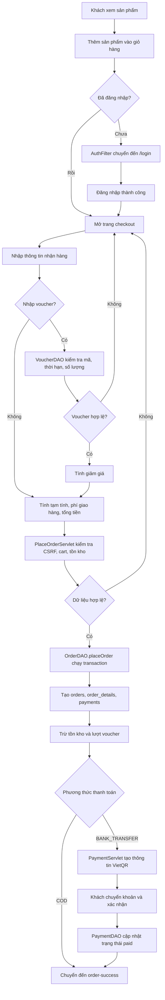

# Hình 4.x. Activity Diagram quy trình đặt hàng và thanh toán

Ghi chú: quy trình này tương ứng với các lớp `CartServlet`, `CheckoutServlet`, `PlaceOrderServlet`, `OrderDAO`, `PaymentServlet`, `PaymentDAO`, `VoucherDAO` và `VietQRUtil`.
