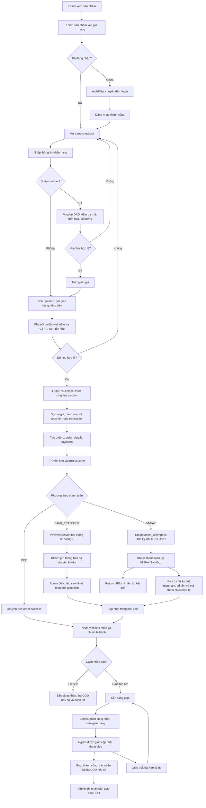

# Hình 4.x. Activity Diagram quy trình đặt hàng và thanh toán

Ghi chú: đơn trả trước chỉ được xác nhận sau khi đã thanh toán. `OrderWorkflowService` kiểm soát bước xử lý, quyền tác nhân, COD và hủy đơn; `GatewayPaymentService` chỉ cập nhật thanh toán từ IPN hợp lệ. Yêu cầu hủy được gửi khi đơn còn chờ xác nhận; trong lúc chờ duyệt, đơn tạm dừng xử lý. Duyệt hủy hoàn tồn kho và lượt voucher một lần; tiền đã nhận được đưa vào đối soát hoàn tiền.
