# Hình 4.x. Use Case Diagram của hệ thống SweetPay Bakery

```mermaid
flowchart LR
    guest["Khách vãng lai"]
    customer["Khách hàng"]
    admin["Quản trị viên"]
    staff["Nhân viên cửa hàng"]
    driver["Nhân viên giao hàng"]
    gateway["VNPAY Sandbox"]

    viewHome(("Xem trang chủ"))
    viewProducts(("Xem/tìm kiếm/lọc sản phẩm"))
    viewDetail(("Xem chi tiết sản phẩm"))
    register(("Đăng ký tài khoản"))
    login(("Đăng nhập"))
    manageCart(("Quản lý giỏ hàng"))
    checkout(("Checkout và áp dụng voucher"))
    placeOrder(("Đặt hàng"))
    payVietQR(("Thanh toán chuyển khoản VietQR"))
    viewOrders(("Theo dõi lịch sử/chi tiết đơn"))
    adminDashboard(("Xem dashboard"))
    adminProducts(("Quản lý sản phẩm và tồn kho"))
    adminOrders(("Quản lý đơn hàng/thanh toán"))
    adminUsers(("Quản lý khách hàng"))
    manageEmployees(("Tạo và phân quyền nhân viên"))
    manageCategories(("Quản lý danh mục bánh"))
    manageVouchers(("Quản lý mã giảm giá"))
    prepare(("Xác nhận và chuẩn bị bánh"))
    inventory(("Điều chỉnh tồn kho"))
    assign(("Phân công giao hàng"))
    deliver(("Cập nhật giao nhận và thu COD"))
    cancelRequest(("Yêu cầu hủy đơn"))
    reviewCancel(("Duyệt hoặc từ chối hủy"))
    reconcile(("Đối soát chuyển khoản, COD và hoàn tiền"))
    onlinePay(("Thanh toán VNPAY Sandbox"))
    reports(("Báo cáo kinh doanh"))

    guest --> viewHome
    guest --> viewProducts
    guest --> viewDetail
    guest --> register
    guest --> login
    guest --> manageCart

    customer --> viewHome
    customer --> viewProducts
    customer --> viewDetail
    customer --> manageCart
    customer --> checkout
    checkout --> placeOrder
    customer --> payVietQR
    customer --> onlinePay
    gateway --> onlinePay
    customer --> viewOrders
    customer --> cancelRequest

    admin --> adminDashboard
    admin --> adminProducts
    admin --> adminOrders
    admin --> adminUsers
    admin --> viewOrders
    admin --> manageEmployees
    admin --> manageCategories
    admin --> manageVouchers
    admin --> assign
    admin --> reviewCancel
    admin --> reconcile
    admin --> reports
    admin --> prepare
    admin --> inventory
    admin --> deliver
    staff --> login
    staff --> prepare
    staff --> inventory
    driver --> login
    driver --> deliver
```

Ghi chú: sơ đồ thể hiện sáu tác nhân của phiên bản mở rộng. Người giao hàng chỉ xem và cập nhật đơn được phân công. VietQR hỗ trợ chuyển khoản đối soát thủ công; VNPAY Sandbox trao đổi yêu cầu và kết quả giao dịch trực tiếp với website khi đã cấu hình merchant. Hoàn tiền thực hiện ngoài website rồi ghi nhận chứng từ.
