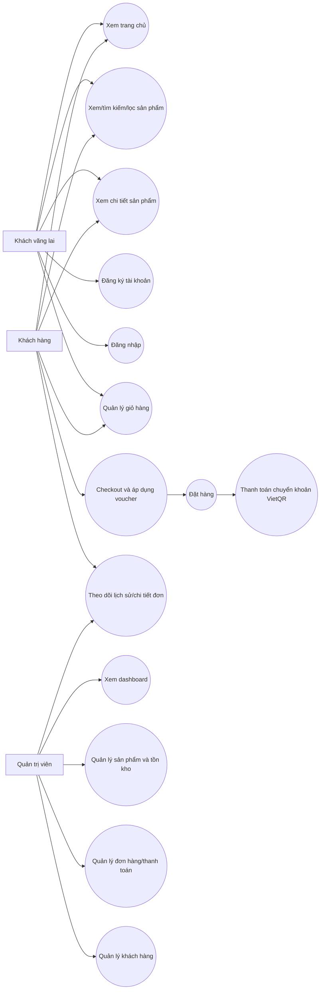

# Hình 4.x. Use Case Diagram của hệ thống SweetPay Bakery

Ghi chú: sơ đồ thể hiện các vai trò thật trong code gồm khách vãng lai, khách hàng đã đăng nhập và quản trị viên. Các use case được suy ra từ servlet/filter/JSP hiện có trong dự án.
